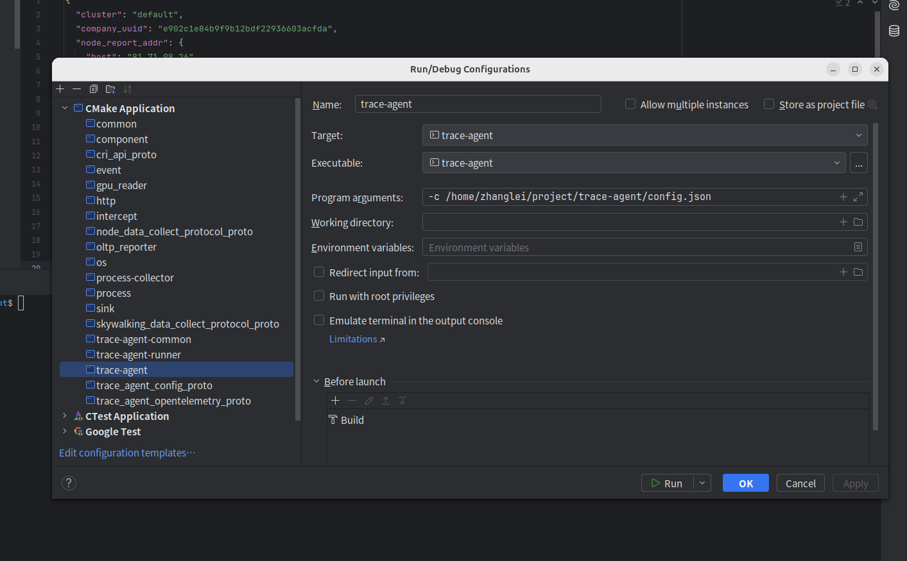

# c++ 开发

## 远程服务器代码下载编译

1.在远程服务器上下载一份 Doris 代码。比如 Doris 根目录为 /home/nova-agent。

```
git clone https://github.com/novawatcher-io/nova-agent.git
```

2.修改远程服务器上 环境变量设置

```
source setup_env.sh
```

3.执行相关命令进行编译。其中详细编译过程可参考[编译文档](/reference/nova-agent/build)。

```
./build_third_party.sh

mkdir build
cmake -S . -B build \
      -DCMAKE_BUILD_TYPE=Release \
      -DTHIRD_PARTY_INSTALL_DIR="${THIRD_PARTY_INSTALL_DIR}" \
      -DCMAKE_MODULE_PATH="${THIRD_PARTY_INSTALL_DIR}/lib/cmake;${THIRD_PARTY_INSTALL_DIR}/lib64/cmake" \
      -DCMAKE_PREFIX_PATH=${THIRD_PARTY_INSTALL_DIR} \
      -DOPENSSL_ROOT_DIR=${THIRD_PARTY_INSTALL_DIR} \
      -DOPENSSL_INCLUDE_DIR=${THIRD_PARTY_INSTALL_DIR}/include \
      -DOPENSSL_CRYPTO_LIBRARY=${THIRD_PARTY_INSTALL_DIR}/lib/libcrypto.a \
      -DOPENSSL_SSL_LIBRARY=${THIRD_PARTY_INSTALL_DIR}/lib/libssl.a
cmake --build . --target nova-agent
```

## 本地 Clion 安装配置远程开发环境

1.在本地下载安装 Clion，导入 Nova Agent 代码。

在 Preferences -> Build, Execution, Deployment -> CMake 中配置 CMake。可以配置类似于 Debug / Release 等不同的 Target， 其中 ToolChain 需要选择刚才配置的。 如果要运行调试 Unit Test 的话，需要在 CMake Options 中配置上 -DMAKE_TEST=ON（该选项默认关闭，需要打开才会编译 Test 代码）

提前设置环境变量

```
source setup_env.sh
```

拉取第三方库

```
git submodule update --init --recursive
```

构建第三方库

```
./build_third_party.sh
```

2.在 Clion 中选择 doris_be 相关的 Target，比如 Debug 或者 Release，进行配置运行。



3.点击运行或者调试 BE。其中点击 Run 可以编译运行 BE，而点击 Debug 可以编译调试 BE。