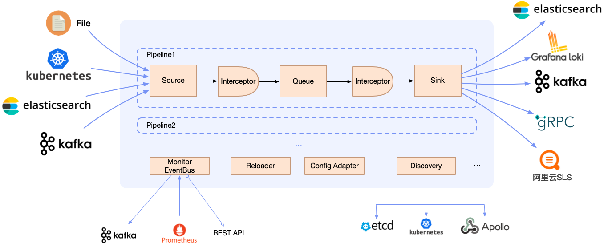

# 核心概念

星瞻是一个基于Golang和c++的轻量级、高性能、云原生可观测监控以及服务器资源调度优化系统，由novaAgent和novaServer中间件组成，提供了：

- :hammer:  **云主机ECS监控以及资源管控解决方案**：同时支持日志采集、Trace数据采集、基础设施指标采集等
- :cloud: **云原生的监控以及资源管控解决方案**：快速便捷的容器日志指标采集方式，自动化调度k8s资源，原生的Kubernetes动态配置下发
- :key: **生产级的特性**：星瞻形成了全方位的可观测性、快速排障、异常预警、自动化资源管控

## NovaAgent-架构

#### Trace数据流

- **Source**：输入源，表示一个具体的输入源，一个Pipeline可以有多个不同的输入源。比如Skywalking Trace数据采集源。
- **Sink**：输出源，表示一个具体的输出源，一个Pipeline仅能配置一种类型的输出源，但是可以有多个并行实例。比如OpenTelemetry sink表示主机指标数据将发送至远端的Otlp服务器。
- **Interceptor**：拦截器，表示一个Trace数据处理组件，不同的拦截器根据实现可以进行日志的解析、切分、转换、限流等。一个Pipeline可以有多个Interceptor，数据流经过多个Interceptor被链式处理。
- **Queue**：队列，目前有内存队列。
- **Pipeline**：管道，source/interceptor/queue/sink共同组成了一个Pipeline，不同的Pipeline数据隔离。

#### 主机基础设施监控

- **cgroup**：收集cgroup数据涉及读取位于/sys/fs/cgroup/文件系统中的文件。这个文件系统包含了关于不同cgroup子系统的层次结构信息以及每个cgroup的资源使用情况。 
- **container**：收集主机容器数据，采集cpu和内存等相关的数据指标。
- **cpu**：收集cpu使用情况数据，例如cpu平台特性、cpu拓扑、cpu使用数据。
- **disk**：收集磁盘使用数据，比如磁盘使用率。
- **gpu**：收集gpu使用数据，比如gpu解码率，gpu使用率等数据。
- **process**：收集process使用数据，比如进程cpu和内存等相关使用情况。
- **其他**：更多指标采集正在开发中。

## NovaServer-架构

- **http接口**：提供进程管理和数据查询接口。
- **grpc接口**：提供进程管控和主机cpu拓扑以及cgroup拓扑数据采集接口。

