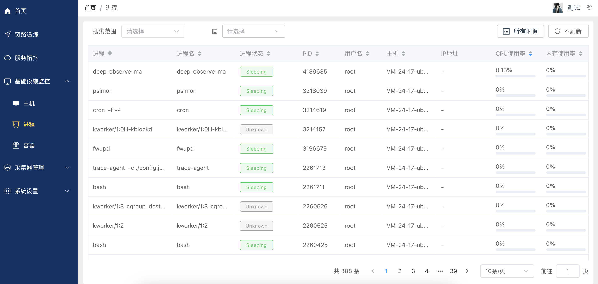
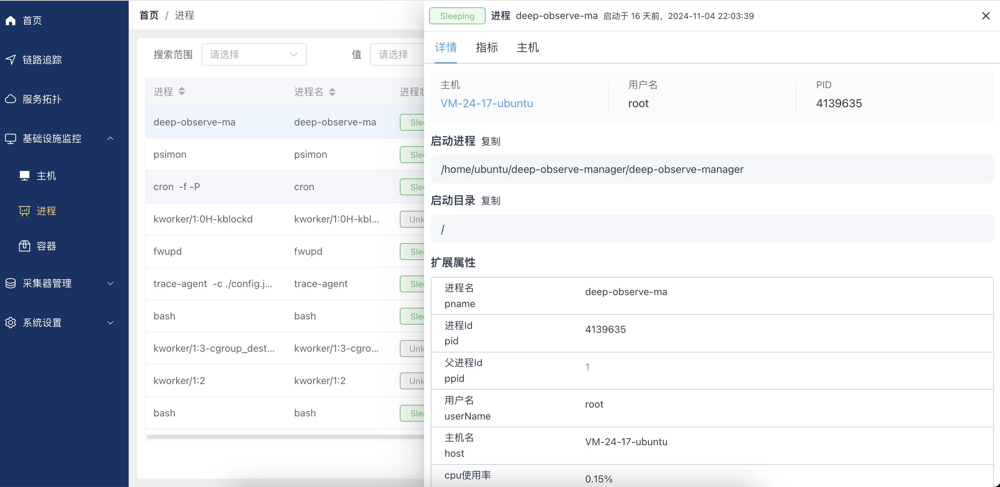
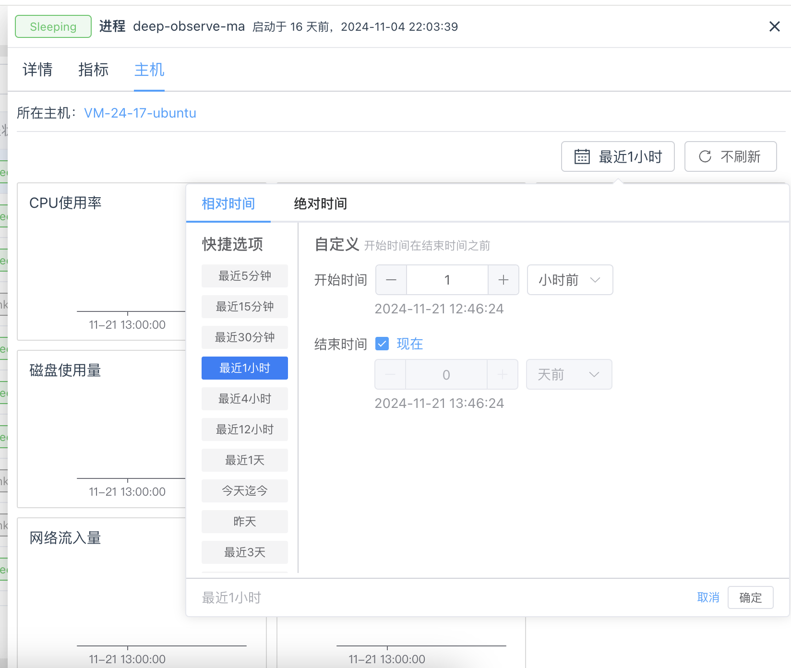
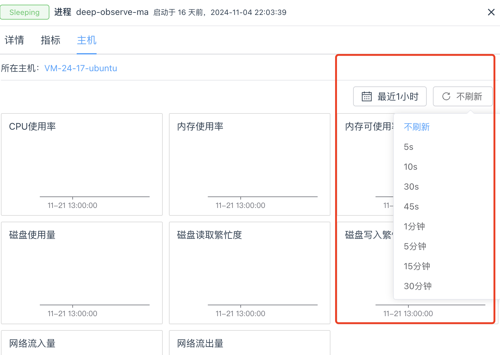

# 基础设施监控-进程使用说明
本文档将指导您如何使用基础设施监控查看进程相关信息，包括进程列表、进程详情、进程指标、主机指标等。

### 点击左侧导航栏“进程菜单”

1. 查询进程
搜索范围：可以按条件对进程进行筛选。
值：选择搜索范围对应的具体的查询条件。

2. 进程列表展示信息
进程名：进程的名称及描述。
进程状态：当前状态（如Sleeping或Unknown）。
PID：进程的唯一标识符。
用户名：运行进程的用户。
主机：进程所在的主机名。
IP地址：进程使用的IP地址（如有）。
CPU使用率：当前CPU资源使用情况。
内存使用率：当前内存资源使用情况。

3. 支持分页显示，每页显示10条记录。

### 进程详情
点击进程列表中的某一项，可以查看主机详情。
可切换选项卡查看不同信息。

1. 进程详情
进程名：进程的名称及描述。
进程状态：当前状态（如Sleeping或Unknown）。
PID：进程的唯一标识符。
用户名：运行进程的用户。
主机：进程所在的主机名。
IP地址：进程使用的IP地址（如有）。
启动时间：进程的启动时间。
点击主机名，可跳转主机详情页面。

2. 启动进程命令
启动进程的命令。
可复制到剪贴板。

3. 进程目录
进程的工作目录。
可复制到剪贴板。

4. 进程的扩展属性展示
进程名 (pname)：进程的名称。
进程ID (pid)：进程的唯一标识符。
父进程ID (ppid)：进程的父级进程标识符（点击进程id可查看进程详情）。
用户名 (userName)：进程的拥有用户。
主机名 (host)：运行进程的主机。
CPU使用率：当前CPU资源的使用情况。
物理内存使用率：当前物理内存的使用情况。
虚拟内存使用率：当前虚拟内存的使用情况。

### 进程指标

1. 在“指标”选项卡中，用户可以查看以下系统性能指标：

- CPU使用率：监控 CPU 在一段时间内的使用率。
- 内存使用率：查看内存的使用情况。
- IO读取速率：查看磁盘的读取速率。
- IO写入速率：查看磁盘的写入速率。
- GPU解码速率：查看GPU的解码速率。
- GPU编码速率：查看GPU的编码速率。
- GPU内存使用率：查看GPU的内存使用率。
- GPU流处理器使用率：查看GPU的流处理器使用率。

2. 选择时间范围
点击右上角的时间选择框，可选取如“最近2周”的数据来查看。
支持选择一段时间范围，如最近一小时、最近一天、最近一周等。

3. 实时刷新
可选择实时刷新，实时获取最新数据。

### 主机指标

1. 在“主机”选项卡中，用户可以查看以下系统性能指标：
显示进程所在主机名
- CPU 使用率：监控 CPU 在一段时间内的使用率。
- 内存使用率：查看内存的使用情况。
- 内存可使用率：显示可用内存的比例。
- 磁盘使用量：监测磁盘空间的使用。
- 磁盘读取繁忙度：读取操作对磁盘负载的影响。
- 磁盘写入繁忙度：写入操作对磁盘负载的影响。
- 网络流入量：网络数据的接收量。
- 网络流出量：网络数据的发送量。

2. 选择时间范围
点击右上角的时间选择框，可选取如“最近2周”的数据来查看。
支持选择一段时间范围，如最近一小时、最近一天、最近一周等。

3. 实时刷新
可选择实时刷新，实时获取最新数据。

4. 主机详情
点击主机名，可查看主机详情。

