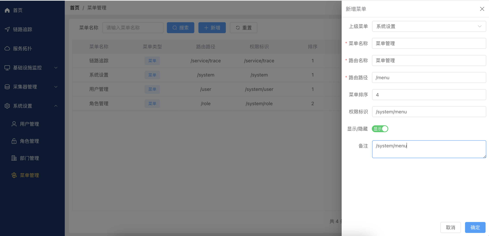
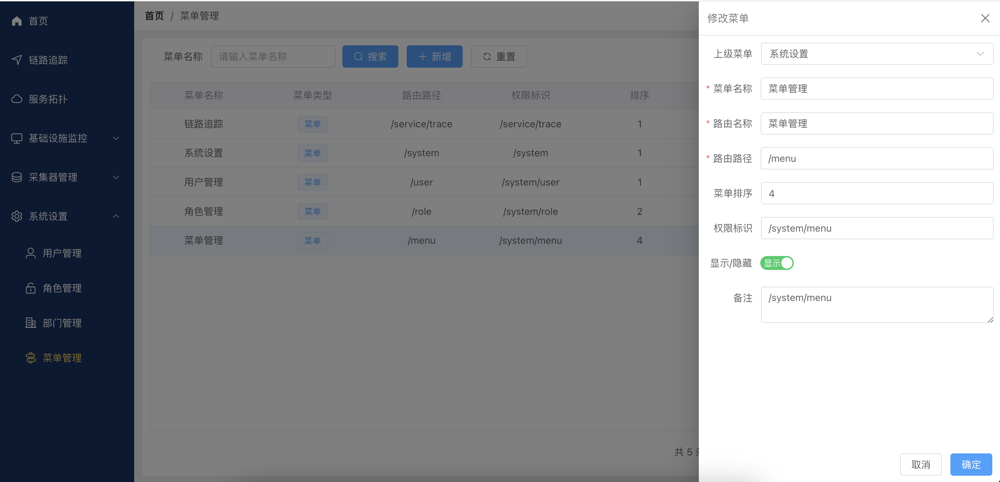

# 系统设置--菜单管理
登录观云智能管理系统后，点击左侧导航栏“系统设置”，进入系统设置页面。

### 点击左侧导航栏“菜单管理”，进入菜单管理页面。
- 查询菜单
菜单名称搜索框：输入菜单名称以查找特定菜单。
- 搜索按钮：点击进行搜索操作。
- 重置按钮：清空搜索条件，显示所有菜单。
- 支持分页显示，每页显示10条记录。

### 点击“新增菜单”按钮，弹出新增菜单对话框。
填写以下信息：
- 上级菜单：选择菜单的父级。若无父级，不用选择。
- 菜单名称：输入菜单名称。
- 路由名称：输入菜单的路由名称。
- 路由路径：输入菜单对应的路由路径。
- 菜单排序：输入菜单的显示顺序。
- 权限标识：输入唯一权限标识，用于权限控制。
- 显示/隐藏：选择菜单是否显示。
- 备注：输入菜单的备注信息。
点击“确定”按钮，完成菜单的新增。

### 修改菜单
在菜单列表中找到需要修改的菜单。
点击菜单项后面的修改按钮。
反显原有菜单信息，根据需要修改所需信息。
点击 “确定” 保存修改；点击 “取消” 取消修改。

### 删除菜单
在菜单列表中找到需要删除的菜单。
点击菜单项后面的删除按钮。
在弹出的确认对话框中点击 “确定” 完成删除。

### 注意事项
新增或修改菜单时，菜单名称和路由路径为必填项。
请确保权限标识的唯一性以避免权限冲突。
如有其他问题，请联系系统管理员。