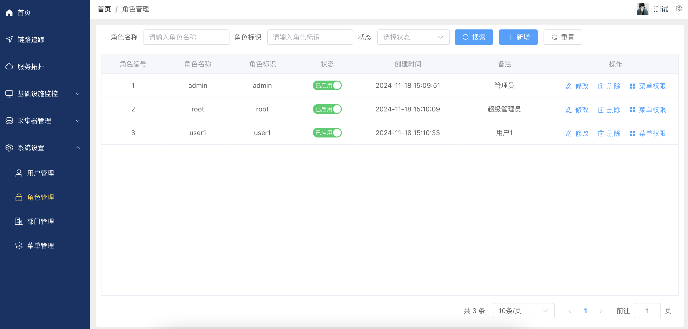
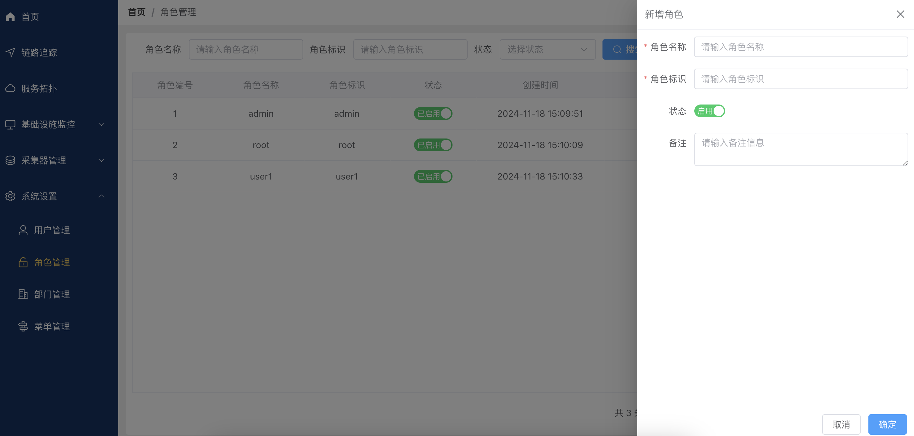
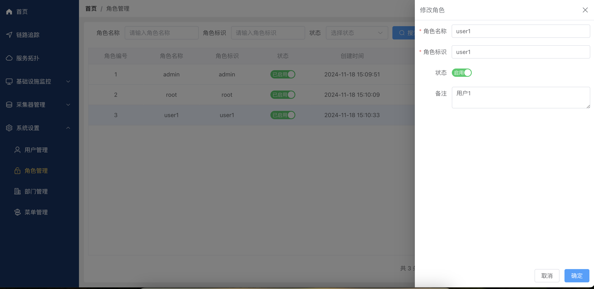

# 系统设置--角色管理使用说明
本文档将指导您如何使用角色管理功能，包括角色的新增、修改和删除，以及角色权限分配。

### 点击左侧导航栏“角色管理”，进入角色管理页面。
- 查询角色
角色名称搜索框：输入角色名称以查找特定角色。
角色标识搜索框：输入角色标识以查找特定角色。
角色状态搜索框：输入角色状态以查找特定角色。
- 搜索按钮：点击进行搜索操作。
- 重置按钮：清空搜索条件，显示所有角色。
- 支持分页显示，每页显示10条记录。

### 点击“新增”按钮，弹出新增角色对话框。
填写以下信息：
- 角色名称：输入角色的名称（必填）。
- 角色标识：输入角色的标识符（必填）。
- 状态：选择角色的启用状态。
- 备注：输入关于角色的备注信息。

### 修改角色信息
在角色列表中找到需要修改的角色。
点击角色项后面的修改按钮。
反显原有角色信息，根据需要修改所需信息。
点击 “确定” 保存修改；点击 “取消” 取消修改。

### 删除角色信息
在角色列表中找到需要删除的角色。
点击角色项后面的删除按钮。
在弹出的确认对话框中点击 “确定” 完成删除。

### 分配菜单
在角色列表中找到需要分配菜单的角色。
点击角色项后面的分配菜单按钮。
在弹出的菜单树中勾选需要分配的菜单，点击 “确定” 完成菜单分配。
支持全选和反选菜单。
支持菜单搜索功能。
