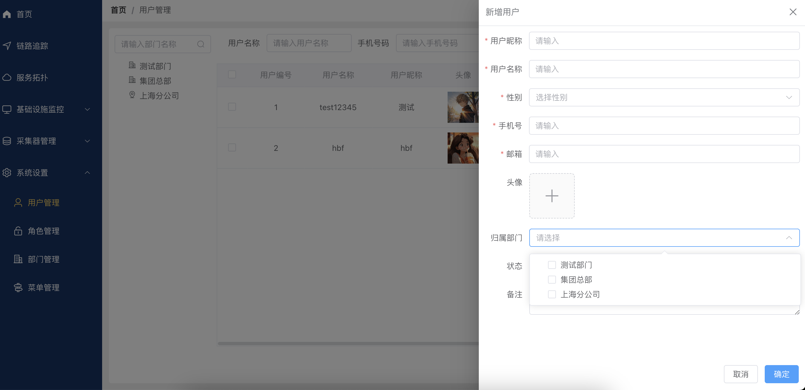
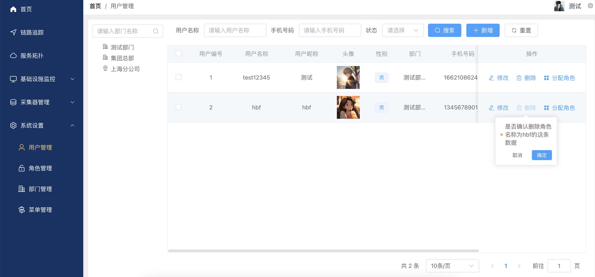
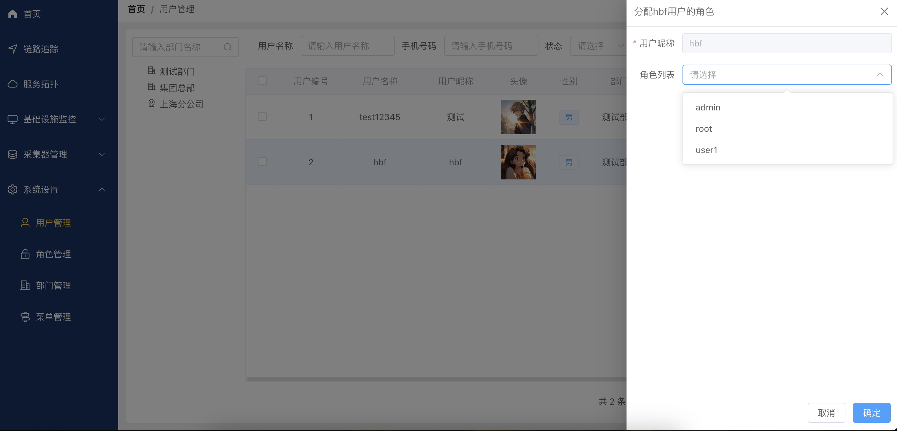
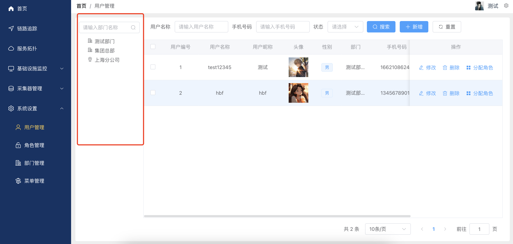

# 系统设置--用户管理
本文档将指导您如何使用用户管理功能，包括角色的新增、修改和删除,以及角色分配权限。

### 点击左侧导航栏“用户管理”，进入用户管理页面。
- 查询用户
用户名称搜索框：输入用户名称以查找特定用户。
手机号码搜索框：输入手机号码以查找特定用户。
状态搜索框：选择状态以查找特定状态用户。
- 搜索按钮：点击进行搜索操作。
- 重置按钮：清空搜索条件，显示所有用户。
- 支持分页显示，每页显示10条记录。

### 点击“新增用户”按钮，弹出新增用户对话框。
填写以下信息：
- 用户昵称：请输入用户的昵称（必填）。
- 用户名：请输入用户的登录名（必填）。
- 性别：从下拉菜单中选择性别（必填）。
- 手机号：输入用户的联系电话号码（必填）。
- 邮箱：输入用户的电子邮箱地址（必填）。
- 头像：点击“+”号按钮上传用户头像图片。
- 归属部门：从下拉菜单中选择用户所在的部门。
- 状态：默认是“已启用”，可以打开或关闭用户状态。
- 备注：输入任何关于用户的其他备注信息。
- 点击“确定”按钮，完成用户的新增。

### 修改用户
在用户列表中找到需要修改的用户。
点击用户项后面的修改按钮。
反显原有用户信息，根据需要修改所需信息。
点击 “确定” 保存修改；点击 “取消” 取消修改。

### 删除用户
在用户列表中找到需要删除的用户。
点击用户项后面的删除按钮。
在弹出的确认对话框中点击 “确定” 完成删除。

### 分配角色
在用户列表中找到需要分配角色的用户。
点击用户项后面的分配角色按钮。
在弹出的角色列表中勾选需要分配的角色，点击 “确定” 完成角色分配。

### 根据部门查询用户
在部门列表中找到需要查询的部门。
点击部门项后面的查询用户按钮。
系统将显示该部门下所有用户。
默认查询所有部门下的用户。

### 注意事项
新增或修改用户时，注意填写必填项。
如有其他问题，请联系系统管理员。